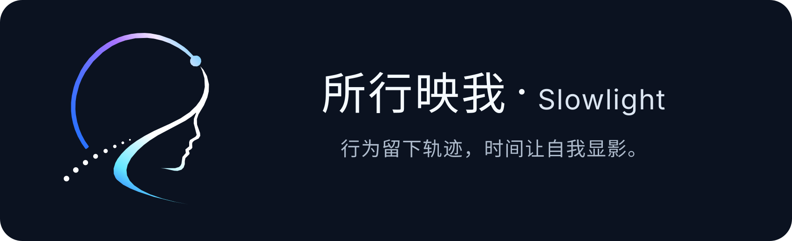

<p align="center">
  
</p>

<h1 align="center">所行映我 · Slowlight</h1>

<p align="center"><strong>行为留下轨迹，时间让自我显影。</strong></p>

<p align="center">
  Local-first 的个人行为记录与自我观察工具。<br />
  记录任务、习惯、专注与观察，让长期事实帮助你看见自己的模式与变化。
</p>

<p align="center">
  
  
  
  
  
  
</p>

> [!IMPORTANT]
> Slowlight 当前处于 **公开预览 / 狗粮验证阶段**，代码版本基线为 `0.2.0-alpha.1`，Windows 与 Android 是主要验证平台。核心任务、习惯、专注、本地数据和云端同步已进入真实使用验证，但当前版本仍建议先备份重要数据，不要把唯一副本交给预览版本。首个公开 Release 会在公开仓库 CI 与实机验收完成后再确定。

## 为什么是 Slowlight

传统 Todo 工具更关心：

```text
计划 → 完成 → 勾掉
```

Slowlight 更关心：

```text
行为 → 事实 → 模式 → 问题 → 反思
```

它不试图告诉你“应该成为谁”，而是帮助你长期看见：**自己实际上正在怎样生活。**

任务、习惯和番茄钟不是最终目的，它们首先是行为入口。随着时间积累，Slowlight 希望把分散的日常记录变成可以回看、比较和解释的个人事实。

核心原则：

- **记录优先，不施压**：先留下真实发生的事情，而不是持续催促完成更多任务。
- **描述事实，不替你下判断**：系统可以发现变化和模式，但不会把推测包装成结论。
- **提问比打分更重要**：回顾应该帮助你思考，而不是给生活打分。
- **你的解释优先**：反思（Reflection）是闭环的一部分，用户自己的理解优先于系统或 AI 的推测。
- **正常时少打扰**：提醒和异常提示服务于观察，而不是制造新的压力。

## 你可以记录什么

| 能力 | 用途 |
| --- | --- |
| **任务** | 任务、清单、标签、子任务、重复任务、提醒与完成记录。 |
| **习惯** | 打卡、补卡、习惯日志和持续变化。 |
| **专注** | 番茄钟与专注会话（WorkSession），记录真实投入时间。 |
| **观察** | 留下与身体、认知、产出、关系有关的观察与反思。 |
| **今天** | 快速看到今天真实发生了什么，并补充记录。 |
| **回顾** | 从事实中查看模式、问题、反思和更长期的变化。 |
| **本地数据** | 使用本机 SQLite，不部署服务器也可以完整记录日常数据。 |
| **云端数据** | 通过 Slowlight Server + PostgreSQL 支持云端持久化和多端同步。 |
| **外部连接** | 飞书多维表格、CalDAV、Webhook 等集成能力。 |
| **AI** | 可使用 Ollama、本地模型或用户自己的 OpenAI / DeepSeek / OpenAI-compatible API。 |

## 当前状态

### 已进入真实使用验证

- ✅ Windows / Android 作为当前主要验证平台。
- ✅ 任务、清单、标签、子任务、重复任务与提醒。
- ✅ 习惯、打卡、补卡与习惯日志。
- ✅ 番茄钟、专注会话与休息记录。
- ✅ 今天 / 回顾 / 分析等行为回顾能力。
- ✅ Local Data：本机 SQLite 数据模式。
- ✅ Cloud Data：Slowlight Server + PostgreSQL。
- ✅ Cloud Data 增量同步、删除语义和冲突处理基础。
- ✅ Local Data：飞书多维表格配置、建表 / 绑定与幂等写入基础。
- ✅ Ollama / OpenAI / DeepSeek / OpenAI-compatible AI Provider。

### 仍在收口

- ⚠️ **Local ↔ Cloud 一键数据迁移尚未完整开放**。切换数据模式不等于自动迁移数据。
- ⚠️ **Cloud Data → 飞书写入与飞书日历同步暂未开放**。在可靠的远端记录映射与幂等 upsert 完成前，系统会明确拒绝该路径，避免重复写入或假成功。
- ⚠️ **飞书 ↔ Slowlight 完整双向同步尚未开放**。
- ⚠️ 多设备删除、离线恢复、冲突、tombstone（删除墓碑）和重复同步仍在进行实机验证。
- ⚠️ 当前仍属于预览版本，重要数据应保留独立备份。

### 暂非当前发行重点

- ⏸ iOS
- ⏸ macOS
- ⏸ Linux
- ⏸ Web

这些平台的源码和品牌母版可以继续存在，但当前公开预览优先保证 Windows 与 Android。

## 5 分钟开始使用

### 直接下载

当前公开 Release 尚未作为稳定发行渠道开放。Windows / Android 验收完成后，会优先通过 GitHub Releases 提供预览构建产物。

现在想体验，请从源码运行。

### 运行 Flutter 客户端

准备 Flutter `3.29.3`，然后：

```bash
git clone https://github.com/z7ping/Slowlight.git
cd Slowlight/client
flutter pub get
flutter run
```

默认可以使用 Local Data，不要求先部署 Slowlight Server。

### 可选：运行 Slowlight Server

只有需要 Cloud Data、多端同步或自托管服务端时才需要后端。需要 Go `1.23.x` 和 PostgreSQL 16。

macOS / Linux：

```bash
cd Slowlight
cp .env.example server/.env
cd server
go run ./cmd
```

Windows PowerShell：

```powershell
cd Slowlight
Copy-Item .env.example server/.env
cd server
go run ./cmd
```

启动前请修改 `server/.env` 中的数据库连接、JWT Secret 和配置加密密钥。真实凭据不要提交到 Git。

更完整的自托管说明见 [`server/README.md`](server/README.md)。

## Local-first 是什么意思

Slowlight 的数据模式与 AI 模式是两个独立选择。

```text
Local Data + Local AI
Local Data + Remote AI
Cloud Data + Local AI
Cloud Data + Remote AI
```

只想自己使用时：

```text
Slowlight Client
      ↓
本机 SQLite
```

不需要部署 Slowlight Server，也不要求把核心业务数据上传到远程服务器。

需要多设备或云端数据时：

```text
Slowlight Client
      ↓
Slowlight Server
      ↓
PostgreSQL
```

可以自行部署 Slowlight Server。源码和普通自构建默认保持 localhost / 自托管语义；官方预览服务地址由 CI/CD 显式注入，不硬编码到公开源码。

AI 与数据存储独立。Local Data 不等于 Offline-only，也不等于 No-AI，可以继续使用 Ollama、本地模型、OpenAI、DeepSeek 或其它 OpenAI-compatible Provider。

## 数据与隐私

Slowlight 涉及个人行为记录，因此数据边界比功能数量更重要。

- Local Data 使用客户端 SQLite。
- Cloud Data 通过 Slowlight Server 持久化到 PostgreSQL。
- 客户端 AI API Key 使用平台安全存储能力保存。
- 服务端飞书等集成 Secret 使用 `CONFIG_ENCRYPTION_KEY` 加密保存；历史明文配置重新保存时迁移为密文。
- 本地 / 云端数据模式切换不会静默自动迁移或覆盖另一侧数据。
- 仓库禁止提交真实 `.env`、数据库凭据、API Key、JWT Secret、Android keystore / 签名密码和私钥。
- 公开仓库应启用 GitHub Secret Scanning / Push Protection，并让项目敏感信息检查与 Gitleaks 在 CI 中真实执行。

详细规则见 [`SECURITY.md`](SECURITY.md)。

## Slowlight 如何形成“自我观察”

```text
Task / Habit / WorkSession / Observation
                ↓
          BehaviorEvent
                ↓
              Facts
                ↓
            Patterns
                ↓
            Questions
                ↓
           Reflection
                ↓
        后续 Review / AI
```

任务完成、习惯打卡、专注结束等不同入口最终可以形成统一的行为事实，让回顾不必只依赖某一个功能模块的局部数据。

Slowlight 固定四个顶层观察维度（Dimension）：

- `body`：身体
- `cognition`：认知
- `output`：产出
- `relationship`：关系

跑步、阅读、写作、家庭、AI 等具体分类属于观察标签（ObservationTag）。标签可以归属某个维度，但不会自动变成新的顶层人生维度。

## 外部连接

### 飞书多维表格

Slowlight 使用统一的集成提供者（Integration Provider）边界接入飞书。

当前真实能力边界：

- ✅ App ID / App Secret 配置。
- ✅ 创建多维表格模板、连接已有多维表格。
- ✅ Local Data 下对任务、专注、休息、标签等数据执行稳定记录标识 + upsert 的写入基础，重复同步避免无条件追加。
- ✅ Secret 安全存储 / 加密保存。
- ⚠️ Cloud Data 下的飞书写入和飞书日历同步暂未开放；在可靠 remote-record mapping / 幂等 upsert 完成前主动失败。
- ⚠️ 飞书完整双向闭环尚未开放。

### 其它连接

当前代码还包含 CalDAV、Webhook 等外部连接能力。后续新增平台应优先复用统一集成边界，而不是为每个平台复制一套独立架构。

## 项目结构

```text
Slowlight/
├── client/                 # Flutter 客户端
├── server/                 # Go 后端与自托管说明
├── docs/                   # 品牌、设计与生成工程文档
├── scripts/                # 构建、安全与一致性检查
├── .github/workflows/      # GitHub CI / 预览构建 / Release 工作流
├── AGENTS.md               # AI Agent 开发协作规则
├── CONTRIBUTING.md         # 贡献指南
├── ROADMAP.md              # 公开产品路线
├── SECURITY.md             # 安全与敏感信息规则
├── THIRD_PARTY_NOTICES.md  # 第三方许可证与归属说明
├── CHANGELOG.md
└── LICENSE                 # MIT License
```

技术栈：Flutter / Dart、Go + Gin + GORM、SQLite、PostgreSQL、JWT。

精确依赖与工程元信息以代码和生成工件为准：

- [`docs/_generated/dependencies.md`](docs/_generated/dependencies.md)
- [`docs/_generated/project-meta.md`](docs/_generated/project-meta.md)

## 开发与贡献

最小验证：

```bash
cd client
flutter pub get
flutter test

cd ../server
go test ./...
```

本地可选启用提交前 Gitleaks 检查：

```bash
git config core.hooksPath .githooks
```

本地未安装 Gitleaks 时不会因为安全 Hook 阻断提交。公开仓库中的远端门禁以 GitHub CI **实际成功执行**并配置为 Required status check 为准，同时应启用 Secret Scanning / Push Protection。

贡献前请阅读 [`CONTRIBUTING.md`](CONTRIBUTING.md)。涉及安全问题请阅读 [`SECURITY.md`](SECURITY.md)。

品牌与图标规范：

- [`docs/design/brand/README.md`](docs/design/brand/README.md)
- [`docs/design/brand/slowlight-logo-horizontal.svg`](docs/design/brand/slowlight-logo-horizontal.svg)
- [`docs/design/brand/slowlight-logo-mark.svg`](docs/design/brand/slowlight-logo-mark.svg)

版本变化见 [`CHANGELOG.md`](CHANGELOG.md)。

## Roadmap

当前顺序：

```text
数据不丢、不重复、不复活
  > Windows / Android 真实可用
  > 同步与外部集成真实验收
  > 体验收口
  > 新功能
```

完整路线见 [`ROADMAP.md`](ROADMAP.md)。

## 品牌

**所行**关注真实发生的行为，而不只关注计划；**映我**强调长期事实帮助用户看见自己，但不替用户定义自己。

Slowlight 使用“长时间显影”的隐喻：单次行为只是信号，经过时间累积，轨迹和轮廓才逐渐清晰。

正式品牌规范与 SVG 主资产见 [`docs/design/brand/README.md`](docs/design/brand/README.md)。

## License

Slowlight 本身使用 [MIT License](LICENSE)。第三方依赖和内嵌组件仍遵循各自许可证，归属与再分发说明见 [`THIRD_PARTY_NOTICES.md`](THIRD_PARTY_NOTICES.md)。
